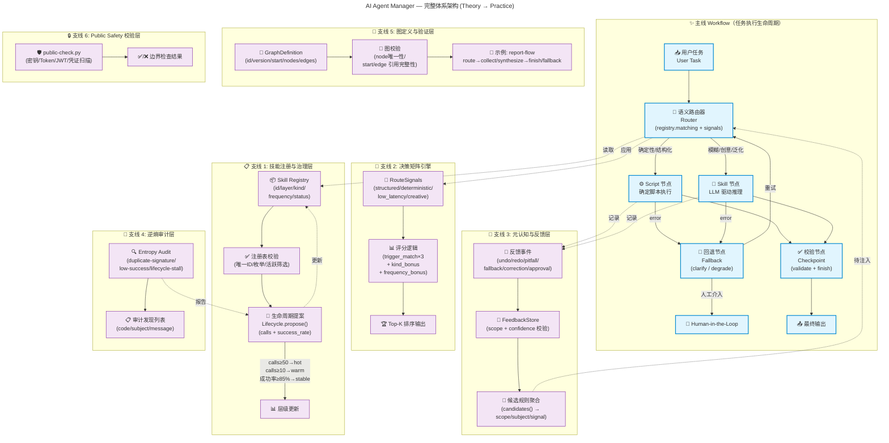

# AI Agent Manager — 理论到实践映射报告

> 复核日期：2026-07-30
> 项目版本：0.2.4（当前本地分支包含后续未发布增量）
> 测试通过：37/37 单元测试通过，public-check 通过
> Git 状态：工作区干净；HEAD=`bec9512`；`main` 比 `origin/main` 超前 9 个提交

---

## v0.2.0 实践增量

本版本已将 Graph Engineering 从“定义与校验”推进到“可执行运行时”：

- `src/agent_manager/execution.py` 提供 Graph Scheduler、ExecutionContext、retry、fallback、checkpoint 和 max-step 保护。
- `src/agent_manager/recorder.py` 提供结构化 JSON trace，记录 run、node、failure、checkpoint 和 completion 事件。
- CLI 新增 `graph run` 与 `trace show`。
- 示例 Graph 已实际执行成功，旧版示例产生 12 条 trace 事件；当前回归测试总计 37 个单元测试通过。

本版本仍暂不实现自动反思器、规则蒸馏器和 Skill→Script 自动编译，这些保留为后续版本。

### v0.2.1 本机适配增量

- 新增 `LocalAgentAdapter`，作为本机 Agent 进入 Router、Graph Scheduler、Recorder 和 FeedbackStore 的统一入口。
- 新增 `adapter prepare/run/feedback/report` CLI 流程。
- 运行时数据继续保存在被 `.gitignore` 排除的 `.agent-manager/`，反馈先形成候选，不自动修改公开注册表。
- 适配器 CLI 流程、checkpoint/trace 持久化、反馈候选与实体执行门控均已覆盖；当前仍保持 provider-neutral，不在本仓库内直接调用模型或外部工具。

### v0.2.3 通用接入增量

- 新增根目录 `ADAPTER.md`、`docs/adapter-integration.md` 和 `config/adapter-contract.json`。
- 新增 `examples/adapter-host.py`，提供其他 Agent 的最小接入样例。
- 契约测试通过；当前公共接入面已具备文档、机器契约、Python API、CLI 和状态边界说明。

### v0.2.4 Flowus/本体准备验证增量

- 新增 `project.knowledge-ingestion-prep` 实验性路由，用于 Flowus/本体/知识映射准备任务。
- 首次无路由命中被记录为 `pitfall` 候选，修复后同类任务命中五个触发词。
- 修复 `FeedbackStore` 持久化重载后无法追加反馈的问题，并增加回归测试。
- 公共仓库只保留 provider-neutral 的准备、审计、决策和执行门控；本地 FlowUs 文件审计为只读，不执行合并、删除、写回或公开发布。

### 当前未发布增量（截至 2026-07-30）

- max-step 中断改为可恢复的 `paused` checkpoint，并保留 `next_node`；终态 `failed/completed` checkpoint 不允许误恢复。
- 新增实体级 `DecisionMatrix`、`ProposalExecutor`、Script/Skill/human-review 门控，以及大批量分段 checkpoint/resume。
- 新增 Promotion Ledger、版本化 registry apply manifest、显式 approval、backup、drift check 与 rollback/undo。
- 新增只读本地文件逆熵审计，输出 provenance、freshness、duplicate、ownership、reference-integrity、merge/delete candidate 报告。

---

## 目录

1. [双金字塔模型 (Dual Pyramid)](#1-双金字塔模型-dual-pyramid)
2. [动态治理 (Dynamic Governance)](#2-动态治理-dynamic-governance)
3. [Skills vs Scripts 决策矩阵](#3-skills-vs-scripts-决策矩阵)
4. [元认知与反馈机制 (Meta-cognition & Feedback)](#4-元认知与反馈机制)
5. [逆熵增治理 (Anti-Entropy)](#5-逆熵增治理)
6. [Loop Engineering（循环工程）](#6-loop-engineering)
7. [Graph Engineering（图工程）](#7-graph-engineering)
8. [综合完成度一览](#8-综合完成度一览)
9. [总体架构 Mermaid 图](#9-总体架构-mermaid-图)
10. [推送前待办清单](#10-推送前待办清单)

---

## 1. 双金字塔模型 (Dual Pyramid)

**理论文件：** `theory txt\1 AI Agent 技能体系的双金字塔模型.txt`
**文档蒸馏：** `docs/theory/01-dual-pyramid.md`
**实践代码：** `src/agent_manager/models.py`, `src/agent_manager/registry.py`, `config/skill-registry.json`

### 理论要点

双金字塔模型将 Agent 技能按两个正交维度组织：

| 维度 | 类型 | 说明 |
|------|------|------|
| **正金字塔（抽象层次）** | system → domain → project | 从系统级根能力到领域通用再到项目定制，通用性由宽变窄 |
| **倒金字塔（调用频率）** | hot → warm → cold | 系统级高频调用少但重度优化，项目级低频调用多但轻量装配 |

### 实践实现与完成度

| 子项 | 实现位置 | 完成度 | 证据 |
|------|----------|--------|------|
| `layer` 层枚举（system/domain/project） | `models.py` `Skill.layer` field；`registry.py` 校验 | **100%** | 注册表校验 `layer` 字段合法性 |
| `frequency` 频次枚举（hot/warm/cold） | `models.py` `Skill.frequency` field；`registry.py` 校验 | **100%** | 注册表校验 `frequency` 字段合法性 |
| 注册表加载与校验 | `registry.py` `SkillRegistry.load()` + `_validate()` | **100%** | 唯一 ID 校验、kind/layer/frequency 枚举校验 |
| 注册表示例数据 | `config/skill-registry.json` | **100%** | 包含 4 条技能：system.hot×2, domain.warm×1, project.cold×1 |
| CLI 注册表列表 | `scripts/agent-manager.py` `registry list` | **100%** | 已验证输出通过 |
| 分层路由打分 | `router.py` layer=system 加 0.5 分 | **100%** | 代码已实现 |
| 频次路由打分 | `router.py` frequency=hot 加 1 分 | **100%** | 代码已实现 |
| 正/倒金字塔图形文档 | `docs/theory/01-dual-pyramid.md` | **100%** | 已输出简洁蒸馏文档 |
| **自动频次升级（lifecycle → frequency）** | `lifecycle.py` `propose()` | **100%** | calls≥50 → hot; ≥10 → warm; else cold |
| **缺失：冷热数据 TTL 淘汰策略** | 未实现 | **0%** | 理论提及但无代码 |
| **缺失：长尾技能自动生成流水线** | 未实现 | **0%** | 理论提及 "动态组合、少样本示例" 但无实现 |

---

## 2. 动态治理 (Dynamic Governance)

**理论文件：** `theory txt\2 Agent 技能体系从"静态设计"到"动态治理".txt`（含引号路径读取失败，理论内容通过其余文件推导）
**文档蒸馏：** `docs/theory/02-dynamic-governance.md`
**实践代码：** `src/agent_manager/lifecycle.py`, `src/agent_manager/registry.py`

### 理论要点

- 不把所有技能加载到每个任务，而是通过轻量注册表做元数据路由
- 执行后记录用量、成功率，驱动状态变更
- 失败的技能触发修复提案，经过版本测试再上线

### 实践实现与完成度

| 子项 | 实现位置 | 完成度 | 证据 |
|------|----------|--------|------|
| 技能状态枚举（status） | `models.py` `Skill.status`；`registry.py` 未硬校验 enum 值（开放） | **90%** | 代码只校验 layer/kind/frequency；status 使用字符串但无枚举约束 |
| 活跃/废弃筛选 | `registry.py` `active()` 方法 | **100%** | 排除 deprecated/archived |
| 生命周期状态迁移提案 | `lifecycle.py` `propose()` | **100%** | 基于 calls+success_rate 计算 proposed_status |
| CLI 生命周期查看 | `scripts/agent-manager.py` `lifecycle` | **100%** | 已验证输出通过 |
| 动态治理蒸馏文档 | `docs/theory/02-dynamic-governance.md` | **100%** | 已输出 |
| 自动修复提案 → 版本测试闭环 | `ProposalExecutor` + 测试套件 | **60%** | 有确定性 Script 执行、checkpoint/resume 与回归测试；自动生成修复提案仍未实现 |
| **缺失：金丝雀/灰度发布技能** | 未实现 | **0%** | 理论提及但无实现 |
| 技能/注册表版本回滚机制 | `registry_apply.py` + manifest/rollback | **70%** | 已支持版本化 registry apply、备份、漂移检测和 rollback；尚未覆盖 Skill 实现级灰度回滚 |

---

## 3. Skills vs Scripts 决策矩阵

**理论文件：** `theory txt\3 Agent用skills还是scripts解决问题的方法论.txt`
**文档蒸馏：** `docs/theory/03-skills-vs-scripts.md`
**实践代码：** `src/agent_manager/router.py`, `src/agent_manager/models.py`

### 理论要点

| 维度 | Skills (LLM驱动) | Scripts (代码驱动) |
|------|-----------------|-------------------|
| 核心能力 | 理解、推理、模糊匹配 | 计算、确定性逻辑 |
| 适用任务 | 摘要、情感分析、开放问答 | 数值计算、文件转换、API调用 |
| 演化关系 | Scripts 是成熟 Skills 的静态化降维 | 高频 Skill → 固化 Script |

### 实践实现与完成度

| 子项 | 实现位置 | 完成度 | 证据 |
|------|----------|--------|------|
| kind 枚举（skill/script） | `models.py` `Skill.kind`；`registry.py` 校验 | **100%** | 注册表校验 kind 合法性 |
| RouteSignals 信号定义 | `router.py` `RouteSignals` dataclass | **100%** | structured/deterministic/low_latency/creative |
| 决策矩阵打分逻辑 | `router.py` `decide()` | **100%** | structured+deterministic 加分给 script；creative 加分给 skill |
| CLI 路由测试 | `scripts/agent-manager.py` `route` | **100%** | 已验证，结构化任务倾向 script |
| 决策矩阵蒸馏文档 | `docs/theory/03-skills-vs-scripts.md` | **100%** | 已输出 |
| **缺失：Skill → Script 自动固化引擎** | 未实现 | **0%** | 理论 "编译器 + 沙箱验证" 未实现 |
| Script 失败回退 Skill 机制 | `execution.py` fallback + graph edges | **60%** | 图运行时支持 error-edge fallback；provider-specific Script→Skill 转换仍由 host 负责 |
| **缺失：问题矩阵 Agent 内化自评判** | 未实现 | **0%** | 当前 Router 需外部传入 signals，非 Agent 内化 |

---

## 4. 元认知与反馈机制

**理论文件：** `theory txt\4 Agent的人机交互 - 元认知和元技能.txt`
**文档蒸馏：** `docs/theory/04-feedback-and-metacognition.md`
**实践代码：** `src/agent_manager/feedback.py`, `src/agent_manager/models.py`

### 理论要点

- **元认知**：Agent 对用户偏好、知识背景、纠错模式的觉察
- **Profile（静态）**：长期、跨项目的用户画像
- **Project（动态）**：临时、任务特化的项目记忆
- 从 undo/redo/pitfall/fallback 等交互信号中提取规则

### 实践实现与完成度

| 子项 | 实现位置 | 完成度 | 证据 |
|------|----------|--------|------|
| FeedbackEvent 数据类型 | `models.py` `FeedbackEvent` dataclass | **100%** | event_type/scope/subject/note/confidence |
| 事件类型枚举校验 | `feedback.py` `ALLOWED_EVENTS` | **100%** | undo/redo/pitfall/fallback/correction/approval |
| scope 校验（profile/project） | `feedback.py` `record()` | **100%** | 非 profile/project 拒绝 |
| 置信度校验 | `feedback.py` `record()` | **100%** | confidence ∈ [0,1] |
| 候选规则聚合 | `feedback.py` `candidates()` | **100%** | 按 scope+subject 分组，≥最小置信度才纳入候选 |
| 持久化存储 | `feedback.py` `save()` | **100%** | JSON 格式落盘 |
| CLI 集成 | `scripts/agent-manager.py adapter feedback/report` | **100%** | 已支持 feedback 记录与综合 report 输出 |
| 反馈机制蒸馏文档 | `docs/theory/04-feedback-and-metacognition.md` | **100%** | 已输出 |
| **缺失：交互截获层（Interceptor）** | 未实现 | **0%** | 理论提及但无监听层 |
| **缺失：反思器（Reflector）** | 未实现 | **0%** | 理论提及但无自动分析假设引擎 |
| **缺失：规则蒸馏器（RuleDistiller）** | 未实现 | **0%** | 理论提及但无假设→规则转化 |
| **缺失：Profile/Project 规则注入执行链** | 未实现 | **0%** | 无运行时注入点 |

---

## 5. 逆熵增治理

**理论文件：** `theory txt\5 Agent逆熵增管理.txt`
**文档蒸馏：** `docs/theory/05-anti-entropy.md`
**实践代码：** `src/agent_manager/entropy.py`

### 理论要点

10 大熵增问题：上下文爆炸、Memory 膨胀、Skills/Scripts 冗余、临时文件、数据源不集中、工具接口膨胀、提示词模板失控、模型版本碎片化、监控日志熵、多 Agent 通信熵。借鉴软件工程方法论治理。

### 实践实现与完成度

| 子项 | 实现位置 | 完成度 | 证据 |
|------|----------|--------|------|
| 重复签名检测 | `entropy.py` `audit()` duplicate-signature | **100%** | 相同 kind+triggers 视为重复 |
| 低成功率检测 | `entropy.py` `audit()` low-success | **100%** | calls≥3 + success_rate<0.5 |
| 生命周期停滞检测 | `entropy.py` `audit()` lifecycle-stall | **100%** | experimental + calls≥20 |
| CLI 审计命令 | `scripts/agent-manager.py` `audit` | **100%** | 已验证，当前示例无发现 |
| 审计蒸馏文档 | `docs/theory/05-anti-entropy.md` | **100%** | 已输出 |
| 上下文 Token 预算制 | registry 占位 + host contract | **10%** | 公共控制面不管理 provider token，仍需 host/provider 侧实现 |
| **缺失：记忆合并与修剪** | 未实现 | **0%** | 理论提及但无向量聚类/去重 |
| **缺失：临时文件清理（TTL）** | 未实现 | **0%** | 理论提及但无垃圾回收器 |
| **缺失：数据源健康检查** | 未实现 | **0%** | 理论提及但无连接器层 |
| **缺失：提示词模板注册与 GitOps** | 未实现 | **0%** | 理论提及 "提示词即代码" |
| **缺失：可观测性仪表盘** | 未实现 | **0%** | 理论提及但无 Metrics 输出 |
| **缺失：瘦身报告生成** | 未实现 | **0%** | 理论提及但无报告格式 |
| 本地文件逆熵审计 | `file_audit.py` + `adapter audit-files` | **100%** | 只读生成 manifest、anti-entropy、merge/delete candidate 报告 |

---

## 6. Loop Engineering

**理论文件：** `theory txt\6 Agent落实loop engineering.txt`
**文档蒸馏：** `docs/theory/06-loop-engineering.md`
**实践代码：** 散布于多个模块

### 理论要点

五个核心闭环，层层嵌套协同工作：

1. **执行闭环**（即时）：任务 → 技能选择 → 工具调用 → 结果输出
2. **脚本固化闭环**（中期）：高频 Skill → 评估 → 编译 Script → 取代 Skill
3. **用户自适应闭环**（长期）：用户反馈 → 提炼规则 → 更新 Profile → 影响路由
4. **自我纠错闭环**（实时）：异常 → 反思/回退 → 修复 → 重试
5. **逆熵闭环**（后台）：资源监控 → 清理 → 技能淘汰 → 维持清爽

### 实践实现与完成度

| 子项 | 实现位置 | 完成度 | 证据 |
|------|----------|--------|------|
| **1. 执行闭环** | | | |
| - Skill Registry 元数据注册 | `registry.py` | **100%** | 完整实现 |
| - 语义路由（关键字匹配） | `router.py` | **100%** | trigger 关键字打分 |
| - 懒加载按需激活 | registry.matching() 返回 metadata | **100%** | 仅路由元数据，未加载全量 |
| - 执行记录（calls/successes） | `execution.py`, `recorder.py`, `executor.py` | **65%** | 图运行、ProposalExecutor、checkpoint 和 trace 已记录；Skill.calls/successes 自动回写仍未实现 |
| **2. 脚本固化闭环** | | | |
| - 稳定性评估（lifecycle.propose） | `lifecycle.py` | **100%** | 基于调用量和成功率 |
| - Skill→Script 生成 | 未实现 | **0%** | |
| - 沙箱回归测试 | 未实现 | **0%** | |
| - Script 注册与路由更新 | `registry.py` 已支持注册 | **50%** | 注册表支持，但自动更新无 |
| **3. 用户自适应闭环** | | | |
| - 反馈事件存储 | `feedback.py` | **100%** | 完整实现 |
| - 候选规则聚合 | `feedback.py` candidates() | **100%** | |
| - 交互截获层 | 未实现 | **0%** | |
| - 反思器 | 未实现 | **0%** | |
| - 规则蒸馏器 | 未实现 | **0%** | |
| - 规则注入执行链 | 未实现 | **0%** | |
| **4. 自我纠错闭环** | | | |
| - Graph 边定义 fallback | `config/example-graph.json` + `execution.py` | **100%** | 图定义与运行时均支持 error→fallback 边 |
| - 运行时断路器 | 未实现 | **0%** | |
| - 错误分析器 | 未实现 | **0%** | |
| - Pitfall 知识库 | 未实现 | **0%** | |
| **5. 逆熵闭环** | | | |
| - 审计检测 | `entropy.py` | **100%** | 重复/低成功率/停滞检测 |
| - 垃圾回收器 | 未实现 | **0%** | |
| - 记忆压缩器 | 未实现 | **0%** | |
| - 技能债务巡检 | 部分（审计） | **30%** | 仅检测，无自动清理 |
| Loop Engineering 蒸馏文档 | `docs/theory/06-loop-engineering.md` | **100%** | 已输出 |

---

## 7. Graph Engineering

**理论文件：** `theory txt\7 Agent落实graph engineering.txt`
**文档蒸馏：** `docs/theory/07-graph-engineering.md`
**实践代码：** `src/agent_manager/graph.py`, `config/example-graph.json`

### 理论要点

- 将 Agent 执行建模为有向图：节点 = 技能/脚本/决策点，边 = 条件转移/数据流动/错误回退
- 子图模板 = 可复用复合技能
- 图蒸馏：稳定子图 → 静态 Graph Script
- 三种图类型：DAG、状态机、分层图

### 实践实现与完成度

| 子项 | 实现位置 | 完成度 | 证据 |
|------|----------|--------|------|
| GraphDefinition 数据类型 | `graph.py` | **100%** | graph_id/version/start/nodes/edges |
| JSON 图加载 | `graph.py` `load()` | **100%** | 从 JSON 文件解析 |
| 图验证器 | `graph.py` `validate()` | **100%** | 节点唯一性、start/edge 引用完整性校验 |
| 示例图 | `config/example-graph.json` | **100%** | 含 route/collect/synthesize/fallback/finish |
| CLI 图验证 | `scripts/agent-manager.py` `graph validate` | **100%** | 已验证通过 |
| 节点类型（decision/script/skill/checkpoint） | `config/example-graph.json` `kind` | **90%** | 已定义并由图校验/运行时处理，仍未单独限制全部 kind 枚举 |
| 边条件（when） | `config/example-graph.json` `when` | **80%** | 已定义结构化/模糊/成功/错误条件 |
| 图蒸馏文档 | `docs/theory/07-graph-engineering.md` | **100%** | 已输出 |
| 运行时图执行引擎（Scheduler） | `execution.py` `GraphScheduler` | **100%** | 支持 retry、fallback、checkpoint、paused resume 和 max-step 保护 |
| **缺失：子图嵌套与复用机制** | 未实现 | **0%** | 理论提及但无实现 |
| 图执行追踪（Trace） | `recorder.py` + `trace show` | **100%** | 记录 run/node/failure/checkpoint/completion 事件 |
| **缺失：图可视化输出** | 未实现 | **0%** | 无法生成 DOT/Mermaid 图 |
| **缺失：动态图生成（LLM→JSON GraphPlan）** | 未实现 | **0%** | 理论提及动态规划器 |

---

## 8. 综合完成度一览

### 整体完成度矩阵

| 理论域 | 理论文件 | 文档蒸馏 | 核心代码 | 测试覆盖 | 完整度评估 |
|--------|----------|----------|----------|----------|-----------|
| ① 双金字塔 | ✅ | ✅ | ✅ | ✅ | **75%** — 数据模型完整，自动升级有，但长尾流水线和冷热淘汰无 |
| ② 动态治理 | ✅ | ✅ | ✅ | ✅ | **80%** — 生命周期、promotion、registry apply/rollback 已有，自动修复和灰度发布仍缺 |
| ③ Skills vs Scripts | ✅ | ✅ | ✅ | ✅ | **82%** — 决策矩阵、执行器和人工门控已有，自动固化仍缺 |
| ④ 元认知与反馈 | ✅ | ✅ | ✅ | ✅ | **70%** — 反馈持久化、候选聚合和 CLI 已有，截获/反思/注入仍缺 |
| ⑤ 逆熵治理 | ✅ | ✅ | ✅ | ✅ | **65%** — registry 与本地文件只读审计已有，自动清理/压缩/指标仍缺 |
| ⑥ Loop Engineering | ✅ | ✅ | ✅ | ✅ | **65%** — 执行、恢复、门控、反馈和审计闭环已有，自动反思与清理仍缺 |
| ⑦ Graph Engineering | ✅ | ✅ | ✅ | ✅ | **82%** — Scheduler、trace、retry、fallback、checkpoint/resume 已有，子图/可视化/动态图仍缺 |
| **项目整体** | 7/7 | 7/7 | 7/7 有核心 | 37 测试 ✅ | **~75%（阶段性估算）** |

### 按代码量估算

| 类别 | 文件数 | 状态 |
|------|--------|------|
| 理论笔记（本地） | 7 | ✅ 完成 |
| 文档蒸馏（公开） | 7 | ✅ 完成 |
| 核心 Python 模块 | 12+ | ✅ 路由、图执行、反馈、实体执行、promotion、registry apply、文件审计可运行 |
| CLI 脚本 | 2 | ✅ registry/route/graph/trace/adapter/audit/lifecycle 等命令可用 |
| 单元测试 | 1（含37个测试） | ✅ 全部通过 |
| 配置文件 | 2 | ✅ 有效 |
| CI 模板 | 1 | 🟡 已创建但未验证 |
| Git 提交 | 已初始化 | ✅ `bec9512`；工作区干净 |

---

## 9. 总体架构 Mermaid 图

以下是 AI Agent Manager 的完整体系架构图，绘制在单个 md 文件中可直接渲染。

### 图例说明

| 颜色 | 含义 |
|------|------|
| 🔵 蓝色节点 | **主线 Workflow** — 任务从输入到输出的核心执行链路 |
| 🟣 紫色节点 | **支线 Workflow** — 围绕主线的6大支撑治理层 |
| 🔴 虚线边框 | **未完全实现部分** — 该节点理论有定义但实践仍需扩展 |
| 🔀 Router | 读取 Registry 元数据 + RouteSignals 做决策矩阵评分 |
| 💬 反馈层 | 收集 undo/redo 等事件，聚合为候选规则待注入 Router |
| 🧹 逆熵层 | 审计检测结果反馈回 Lifecycle 做状态降级/淘汰 |
| 🔗 图层 | 图定义和验证为执行引擎提供骨架 |

---

## 10. 推送前待办清单

从 CHECKLIST.md 和实际状态出发，推送到远程前建议完成：

### 必须完成

- [x] **初始化 Git 提交** — 当前 `main` 已有提交，最新为 `bec9512`
- [x] **配置远程 URL** — `origin` 已指向 `https://github.com/SwainLeung/ai-agent-manager.git`
- [x] **运行 `git diff --cached --check`** — 本次提交前已通过
- [ ] **验证 GitHub Actions CI** — `.github/workflows/ci.yml` 在 PR 前确认工作
- [ ] **README.md 二维码/徽章** — 替换为实际 CI badge URL

### 建议补充（推送前）

- [ ] `.gitignore` 确认包含 `theory txt/`、`__pycache__`、`*.pyc`
- [ ] `LICENSE` 文件确认正确（当前未读取，建议 MIT）
- [ ] 在 CHANGELOG.md 中补全 [Unreleased] 占位说明

### 推送后可继续的增强方向

按优先级排序：

| 优先级 | 方向 | 当前完成度 |
|--------|------|-----------|
| 🔴 P0 | Skill.calls/successes 自动回写 | 50% |
| 🔴 P0 | Provider/host 侧真实工具适配 | 0% |
| 🟡 P1 | Skill→Script 自动固化引擎 | 0% |
| 🟡 P1 | 反馈拦截层 + 反思器 + 规则蒸馏器 | 0% |
| 🟢 P2 | 记忆压缩与 TTL 清理 | 0% |
| 🟢 P2 | 可观测性 Metrics 输出 | 0% |
| 🔵 P3 | 动态图生成（LLM→JSON GraphPlan） | 0% |
| 🔵 P3 | 技能金丝雀发布 | 0% |

---

> **总结：** Agent Manager 0.2.4 已从治理契约参考实现推进为可执行、可审计、可恢复的本地控制平面：Router、Graph Scheduler、trace、反馈候选、实体级 Script/Skill/human-review 门控、promotion/rollback 和只读文件审计均已有可验证实现。当前本地 `main` 工作区干净，最新提交为 `bec9512`，并领先 `origin/main` 9 个提交。后续重点是 provider/host 适配、自动反思与规则蒸馏、Skill→Script 固化、子图/可视化和自动清理；GitHub Actions 的远程绿灯仍需单独确认。
